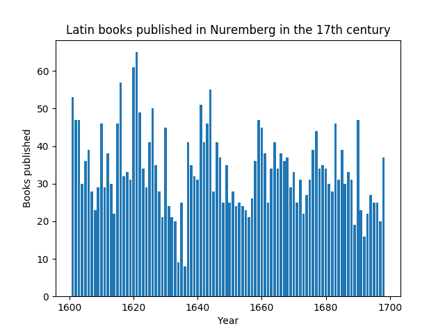

# digneolatin – Digital Tools and Neo-Latin texts

## Why **digital** Neo-Latin studies?

Huge production of Neo-Latin texts throughout the early modern period. Well into the 18th century Latin was the single most used language in Europe, outnumbering 
texts in English, French, German and Italian.

Still, Neo-Latin Studies as a discipline is relatively small. Increasingly few scholars read Latin outside the traditional Classics departments (with their focus on ancient Latin). Thus Neo-Latin texts (and their impact on early modern culture) are underrepresented.

Digital methods are indispensable for us to cope with the quantities of texts that have come upon us.

A timeline from USTC that show the yearly print output in Latin from 1520 through 1650.


As Neo-Latin texts present scholars with specific questions and challenges where digital tools can offer

# In the chart room - bibliographic tools

A good way to get an overview of what was written and published in the early modern period are, of course, bibliographies. Many countries have so-called retrospective national bibliographies that generally cover all books published in certain region. The most important ones of these bibliographies have been made available and searchable online. 

## USTC

The [USTC](https://www.ustc.ac.uk/) offers a very wide collection of bibliographic data and, via the web form, useful search functionalities. Unfortunately 

## VD16, VD17, VD18

### VD17 and VD18

Both databases use the GBV infrastructure and can therefore be accessed via an SRU-interface.[^1]

The following example shows a basic database research in Python. The query looks for all Latin books printed in Nürnberg in 1640.


```python
import requests

vd17_endpoint = "http://sru.k10plus.de/vd17"
parameters = {
        'version' : '1.1',
        'operation' : 'searchRetrieve',
        'recordSchema' : 'marcxml',
        'query' : 'pica.jah=1640 and pica.vlo=Nürnberg and pica.spr="lat"',
        'maximumRecords' : '10',
        'recordXPath' : '//*:numberOfRecords'
        }

print(requests.get(vd17_endpoint, params=parameters).text)
```

A slightly more complex example shows the development of printing numbers in Nuremberg throughout the 17th century:

```python
import requests
from lxml import etree
import matplotlib
import matplotlib.pyplot as plt

def query_vd17(year):
    vd17_endpoint = "http://sru.k10plus.de/vd17"
    parameters = {
            'version' : '1.1',
            'operation' : 'searchRetrieve',
            'recordSchema' : 'marcxml',
            'query' : f'pica.jah={str(year)} and pica.vlo=Nürnberg and pica.spr="lat"',
            'maximumRecords' : '10',
            }
    return requests.get(vd17_endpoint, params=parameters)
    
publication_numbers = []
years = range(1601,1699)
for year in years:
    root = etree.fromstring(query_vd17(year).content)
    hits = root.find('{http://www.loc.gov/zing/srw/}numberOfRecords').text
    publication_numbers.append(int(hits))

fig, ax = plt.subplots()
ax.plot(years,publication_numbers)
ax.set(xlabel='Year', ylabel='Books published',
               title='Latin books published in Nuremberg in the 17th century')
fig.savefig("vd17_nuremberg.png")
plt.show()

```

This produces the following output:




## STCN/STCV

API access

# Digitizing the *mare magnum*


## OCR

+ [OCR4all](www.ocr4all.org)

# Exploring the *terra incognita*

## Lemmatizer / POS-Tagger

+ [LatMor](https://www.cis.uni-muenchen.de/~schmid/tools/LatMor/)
+ [LEMLAT](https://github.com/CIRCSE/LEMLAT3)
+ William Whitaker’s Words
+ [Morpheus](https://github.com/PerseusDL/morpheus)
+ PROIEL
+ Parsley
+ [Tree Tagger](https://www.cis.uni-muenchen.de/~schmid/tools/TreeTagger/)
+ [CST’s lemmatizer](https://cst.dk/online/lemmatiser/uk/)
+ Sparv
+ [Collatinus](https://github.com/biblissima/collatinus)
+ [Lamonpy](https://github.com/bab2min/lamonpy)


## Word2Vec


...

## Semantics

+ [LatinWordNet](https://latinwordnet.exeter.ac.uk/)

## Tools

### CLTK 

The [The Classical Language Toolkit](cltk.org) is a collection of Python modules that can be used for some crucial tasks.


## Latin BERT

The Latin BERT is trained on a chronologically wide ranging corpus of Neo-Latin texts, including also Latin Vicipaedia. The do not, however, use the large Camena corpus.
 
[Bamman/Burns 2020](https://arxiv.org/abs/2009.10053), [Github Repository](https://github.com/dbamman/latin-bert)

# Text Corpora

## Camena

## CroaLa

## CTS-/CITE-Architecture

For digital Neo-Latin texts from various corpora to become citable and interoperable it is necessary to use a standardized reference architecture that provides URIs which allow to refer to specific texts, passages, sentences, phrases, words in a text, cf. https://github.com/nevenjovanovic/cts-croala

# Authority files

## Wikidata

Wikidata is a treasuretrove for every kind of information. Thanks to its SPARQL-endpoint, highly complex queries are possible. A rather simple expamle (many more can be found [here](https://www.wikidata.org/wiki/Wikidata:SPARQL_query_service/queries) and tried out [here](https://query.wikidata.org/)):

```SPARQL

SELECT ?authorLabel ?title ?year 
WHERE {
  ?book wdt:P407 wd:Q397.
  ?book wdt:P31 wd:Q7725634 .
  ?book wdt:P50 ?author.
  ?book wdt:P1476 ?title. 
  ?book wdt:P577 ?year.
  FILTER ( year(?year) > 1600 ).
  FILTER ( year(?year) < 1800 ).
  SERVICE wikibase:label {
    bd:serviceParam wikibase:language "en" .
   }
  }
```

The query is a GET request and can thus be integrated in a simple Python script, e.g.:

```python

import requests

wikidata_endpoint = "https://query.wikidata.org/sparql"
query = """
SELECT ?authorLabel ?title ?year 
WHERE {
  ?book wdt:P407 wd:Q397.
  ?book wdt:P31 wd:Q7725634 .
  ?book wdt:P50 ?author.
  ?book wdt:P1476 ?title. 
  ?book wdt:P577 ?year.
  FILTER ( year(?year) > 1600 ).
  FILTER ( year(?year) < 1800 ).
  SERVICE wikibase:label {
    bd:serviceParam wikibase:language "en" .
   }
  }
 
        """

parameters = {
        'query' : query,
        'format' : 'JSON'
        }

headers = {"Accept" : "application/json"}

res = requests.get(wikidata_endpoint,headers=headers,params=parameters)

print(res.text)

```

## VIAF

The documentation of the VIAF API can be found [here](https://www.oclc.org/developer/develop/web-services/viaf/authority-cluster.en.html)

Geographic
## Geographic data

??

# Lexical resources

## J. Ramminger: Neulatein.de

[Dictionary](http://nlw.renaessancestudier.org) comprising more than 21.000 words, no API.


# Community

+ [Blog](https://jramminger.github.io/) by Johann Ramminger about OCR/digital Neo-Latin

# Projects

+ NOSCEMUS (ERC, collaboration with Transcribus to create OCR/HWR-models)
+ Bietti et. al: Bloem, Jelke, Maria Chiara Parisi, Martin Reynaert, Yvette Oortwijn, und Arianna Betti. „Distributional Semantics for Neo-Latin“, o. J., 10.

[^1]: Documented [here (VD17)](https://uri.gbv.de/database/vd17) and [here (VD18)](https://uri.gbv.de/database/vd18). All supported query terms can be found [here (VD17)](http://sru.k10plus.de/vd17).
