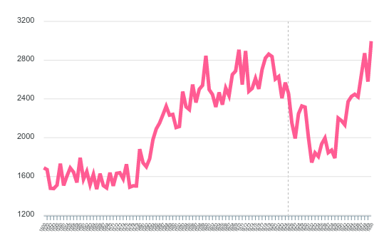

# digneolatin – Digital Tools and Neo-Latin texts

# In the chart room - bibliographic tools

## USTC

Wide collection of bibliographic data, good search functionalities, no API

# Digitizing the *mare magnum*

## OCR

+ [OCR4all](www.ocr4all.org)

# Exploring the *terra incognita*

## Lemmatizer / POS-Tagger

+ [LatMor](https://www.cis.uni-muenchen.de/~schmid/tools/LatMor/)

## Word2Vec

...

## Semantics

+ [LatinWordNet](https://latinwordnet.exeter.ac.uk/)

## Tools

+ [The Classical Language Toolkit](cltk.org)

# Text Corpora

## Camena

## CroaLa

